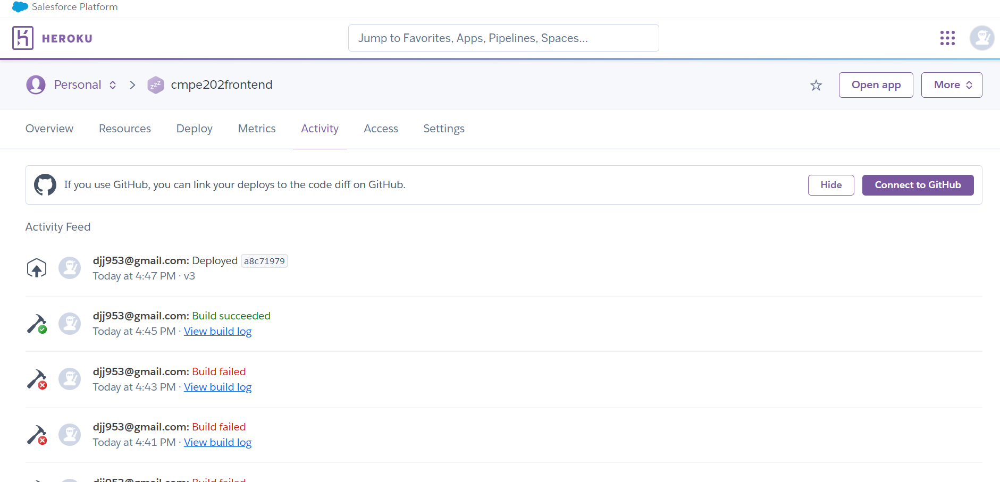
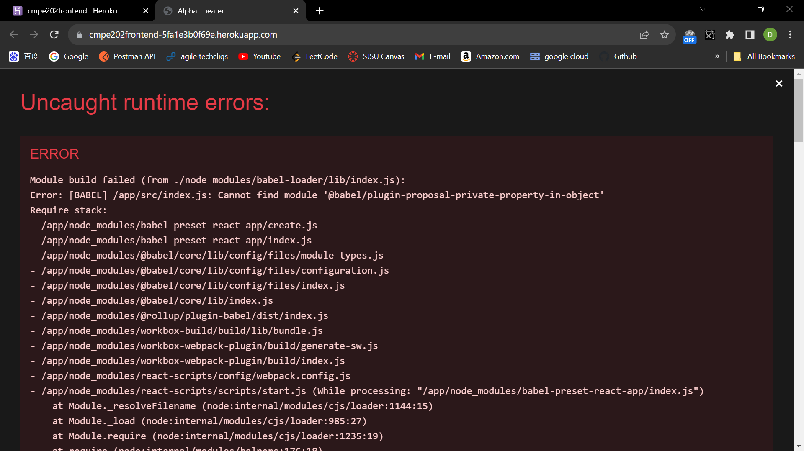

CMPE-202-1 Class Project - Movie Theater end-to-end

Due: 12/1/23

"""

Team Alpha's project repo for implementing an end2end MovieTheater Club application for your favorite movie theater chain.
The system can manage multiplexes in many locations i.e. each location has multiple screens.

"""

Instructor:
- Gopinath Vinodh, Classroom: ENG 325

Group Name: 
- Team Alpha

Members + Summary of Contributions (for each team member):
- Yifu Fang: Yifu took charge of the project architecture. He created the outline for the frontend and backend, researched improvements to the design with Tailwind, wrote the implementation of the Dashboard for employee and users, and handled most of the communication between the frontend requests and backend responses.

- Jiajun Dai: Jiajun worked on the Book Tickets and Employee Scheduling and Actions implementation. Jai was incredible at giving tons of feedback and answered most of the team questions within minutes. Jai also filled the database with mock data and filled out the film schedules.

- Anthony Zunino: Anthony worked on login and registration with server sided session tokens (cookies) to authenticate the user requests to the backend. Wrote the backend query requests for the user table. Anthony also tracked all Scrum meetings and maintained project deliverables.

- Jena Kelbessa: Jena worked on user authentication at the beginning of the project and helped ask questions on the logistics of the architecture. Created the skeleton for the login page.

Feature Set:
- View pages (home, buy tickets, buy membership, user profile), book tickets, cancel ticket, login, register, upgrade membership, downgrade membership, view purchased movies, view user dashboard, view admin dashboard, admin add theater, admin change seat occupancy, admin add movie, admin cancel movie, configure discount prices

Helpful Links:

- Github link:
  - https://github.com/gopinathsjsu/teamproject-team-alpha-1
- Link to Project Journal (also contains Project Board and Task Sheet):
  - https://github.com/gopinathsjsu/teamproject-team-alpha-1/blob/main/ScrumMeeting/TeamAlphaProjectJournal.pdf

- Syllabus:
  - https://sjsu.instructure.com/courses/1570055/files/74025430?wrap=1
- Excel of team info:
  - https://docs.google.com/spreadsheets/d/1qowXku9R0LjOND2gilTmbdbIUMP-fOhZU7j70APLi4w/edit#gid=0

---

### Class Diagram:


---

### UI Wireframe:


---

### Cloud Deployment Screenshots:





- We had deployed the frontend to the cloud.
- but theres issue deploy backend
---

## Prepration for running on windows

- Install Redis Server for windows
- download mysql installer and install mysql server and workbench. https://dev.mysql.com/downloads/file/?id=519997
  - you will be asked to configure root and password.
  - you will need to modify the these 2 line at Backend/config.py
  ```
    self.config['MYSQL_USER'] = 'you_root'
    self.config['MYSQL_PASSWORD'] = 'you_password'
  ```
## How to run our Python Flask Back-end:

- Make sure you installed your interpreter with a virtual environment '<your path>\teamproject-team-alpha-1\Backend' (venv)

```
python -m venv myenv
```

- make sure the path is '<your path>\teamproject-team-alpha-1\Backend', activate your venv first with this command:

```
.\myenv\Scripts\activate
```

- then run:

```
 pip install -r .\requirements.txt
```

- Now you can start your backend locally with:

```
python app.py
```

- when you finsih the session of programming. deactivate the virtual environemnt:

```
deactivate
```

#### Useful commands for backend:

- when you installed some library in your virtual environment, and you want to include it into requirements.txt. this command automatically detects the library or dependencies in your environment and add it to requirements.txt

```
pip freeze > requirements.txt
```


## How to run our React Front-end:

- install node.js. https://nodejs.org/en
- after installation of node.js. run the following command to install the dependencies and neccessary files for this project.

```
npm install
```

- Now you can start your frontend locally with:

```
npm start
```


## Front-end routing

### Home: /

    /
    /membership
    /book-tickets
    /about-us
    /dashboard

- / homepage display with current movie schedule, and upcoming movie
- /membership display the options to buy regular or premium membership
- /book-tickets buy moview tickets with a online service fee ($1.50 per ticket).
- /about-us different theaters, location
- /dashboard depending on the logged in user, it display a different dahsboard and different functionality. user, premium, or employee.

---

### Auth:

##### authentication

    /auth/log-in
    /auth/sign-up

- /auth/login display the inputbox username and passward. user can select the method of login as admin or member
- /auth/sign-up display the signup page prompt user to sign up, then save the data on database.
